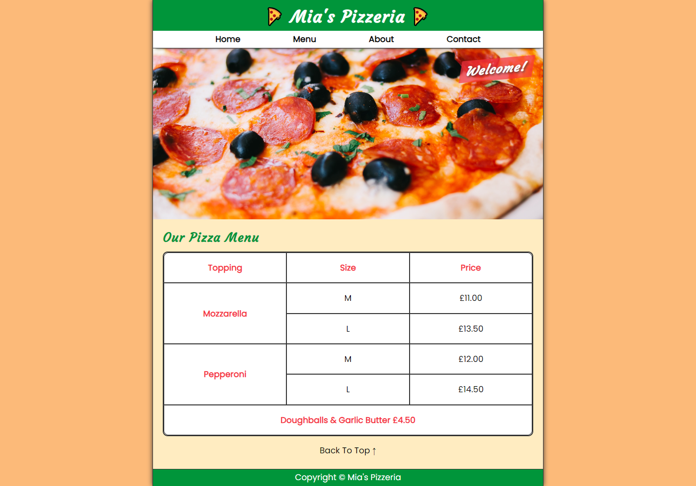
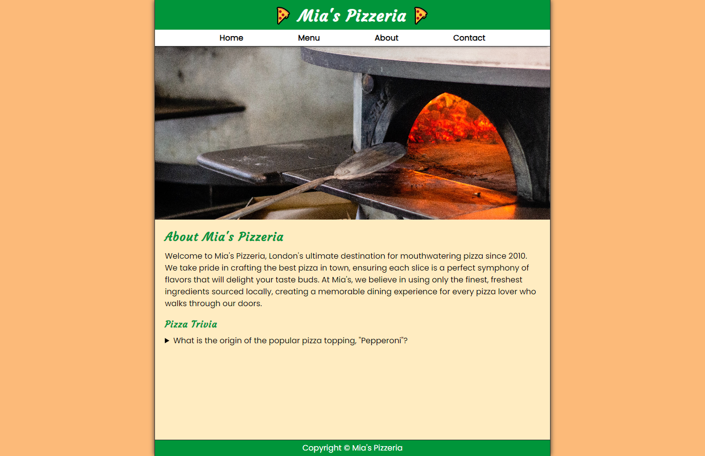
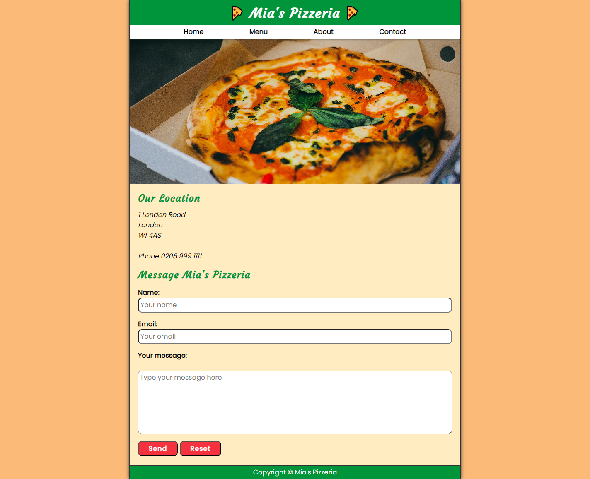

# Website for Mia's Pizzeria

I created a website for a London-based pizzeria using HTML and CSS. Images courtesy of Unsplash.

## Outcomes:

I found this little project fun to focus on developing my CSS skills. I now feel comfortable with creating a website in vanilla HTML and CSS. The key CSS declarations and properties I feel more familiar with now are Flexbox and Grid, arguably the hardest to understand!

My next project will be to create a custom WordPress theme, further developing my PHP, HTML and CSS skills.

## Screenshots:

### Homepage:

### About:

### Contact:

